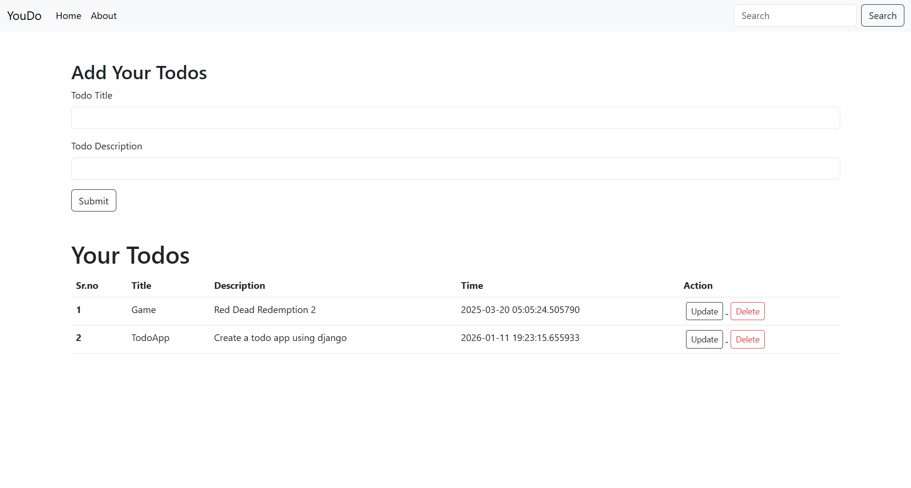

# 📝 Todo App

<div align="center">

*"The secret of getting ahead is gg started." - Mark Twain*

</div>

---

## Preview



---

## About

This is a simple yet powerful Todo Application built with Flask and SQLAlchemy. It helps you manage your daily tasks efficiently with a clean and intuitive user interface. You can create, update, and delete tasks with ease. Each task is stored in a local SQLite database, ensuring your data is safely persisted.

The app provides a responsive design that works seamlessly across different devices, allowing you to manage your tasks whether you're on desktop or mobile. With features like task creation, editing, and deletion, you have complete control over your productivity.

---

## Tech Stack

- **Backend Framework**: Flask 3.1.0
- **Database ORM**: SQLAlchemy 2.0.38
- **Database**: SQLite
- **Templating Engine**: Jinja2 3.1.5
- **WSGI Server**: Werkzeug 3.1.3
- **Production Server**: Gunicorn 23.0.0
- **Language**: Python 3.13
- **Frontend**: HTML5, CSS3, JavaScript

---

## Project Structure

```
c:\Python Flask\
├── todo.py                 # Main Flask application
├── requirements.txt        # Project dependencies
├── README.md              # This documentation
├── todo.db                # SQLite database
├── instance/              # Instance folder
├── templates/             # HTML templates
│   ├── base.html         # Base template
│   ├── index.html        # Main page
│   └── update.html       # Update task page
├── static/                # Static files (CSS, JS, images)
├── __pycache__/          # Python cache files
└── env/                   # Virtual environment
```

---

## Getting Started

### Prerequisites

Make sure you have the following installed on your system:

- Python 3.8 or higher
- pip (Python package manager)
- Git

### Installation Steps

#### Step 1: Clone the Repository

```bash
git clone https://github.com/yourusername/todo-app.git
```

#### Step 2: Navigate to the Project Directory

```bash
cd todo-app
```

#### Step 3: Create a Virtual Environment

```bash
python -m venv env
```

#### Step 4: Activate Virtual Environment

**On Windows:**
```bash
.\env\Scripts\activate
```

**On macOS/Linux:**
```bash
source env/bin/activate
```

#### Step 5: Install Dependencies

```bash
pip install -r requirements.txt
```

#### Step 6: Run the Application

```bash
python todo.py
```

#### Step 7: Open in Browser

Visit: `http://localhost:5000`

---

## Dependencies

All dependencies are listed in `requirements.txt`:

```
Flask==3.1.0
Flask-SQLAlchemy==3.1.1
SQLAlchemy==2.0.38
Werkzeug==3.1.3
Jinja2==3.1.5
click==8.1.8
itsdangerous==2.2.0
MarkupSafe==3.0.2
greenlet==3.1.1
gunicorn==23.0.0
```

---

## Features

✅ Create new tasks  
✅ Update existing tasks  
✅ Delete tasks  
✅ View all tasks with timestamps  
✅ Persistent data storage with SQLite  
✅ Clean and responsive UI  

---

## License

This project is open source and available under the MIT License.

---

<div align="center">

**Made with ❤️ using Flask**

</div>
